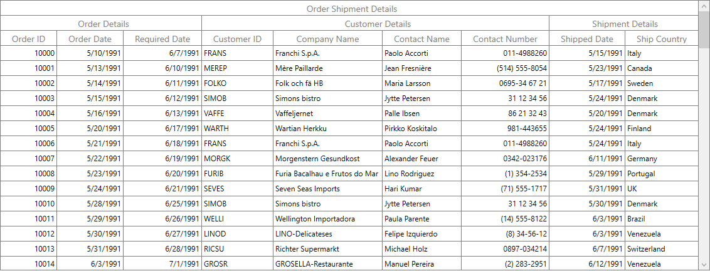
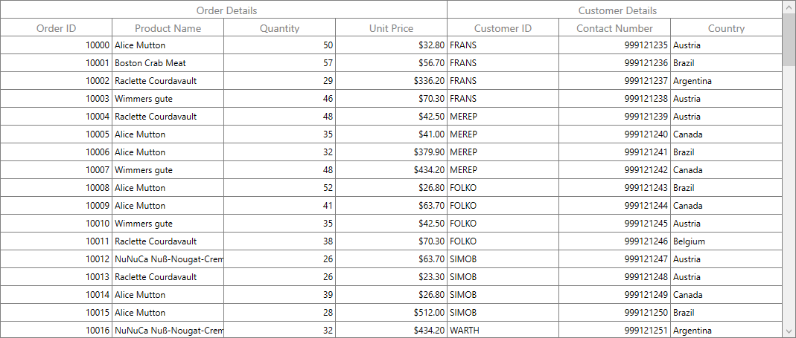
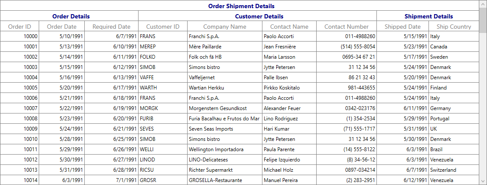

# How to create wpf datagrid with multiple header rows (stacked header rows)?

## About the sample

This example illustrates how to create SfDataGrid with multiple header rows using StackedHeaderRows.

[WPF DataGrid](https://www.syncfusion.com/wpf-ui-controls/datagrid) (SfDataGrid) supports to add additional unbound header rows using [StackedHeaderRows](http://help.syncfusion.com/cr/wpf/Syncfusion.UI.Xaml.Grid.StackedHeaderRows.html). This can be used to add multiple header rows for the SfDataGrid and to group one or more columns under each stacked header.

Each [StackedHeaderRow](http://help.syncfusion.com/cr/wpf/Syncfusion.UI.Xaml.Grid.StackedHeaderRow.html) contains [StackedColumns](https://help.syncfusion.com/cr/wpf/Syncfusion.UI.Xaml.Grid.StackedHeaderRow.html#Syncfusion_UI_Xaml_Grid_StackedHeaderRow_StackedColumns) where each [StackedColumn](http://help.syncfusion.com/cr/wpf/Syncfusion.UI.Xaml.Grid.StackedColumn.html) contains a number of child columns. You can set the text displayed in the stacked column by using `StackedColumn.HeaderText` property.

```Xaml

<syncfusion:SfDataGrid AllowDraggingColumns="True" Margin="5"
                               ItemsSource="{Binding OrderList}">
    <syncfusion:SfDataGrid.StackedHeaderRows>
        <syncfusion:StackedHeaderRow>
            <syncfusion:StackedHeaderRow.StackedColumns>
                <syncfusion:StackedColumn ChildColumns="OrderID,OrderDate,RequiredDate,CustomerID,Customers.CompanyName,Customers.ContactName,Customers.Phone,ShippedDate,ShipCountry" HeaderText="Order Shipment Details" />
            </syncfusion:StackedHeaderRow.StackedColumns>
        </syncfusion:StackedHeaderRow>
        <syncfusion:StackedHeaderRow>
            <syncfusion:StackedHeaderRow.StackedColumns>
                <syncfusion:StackedColumn ChildColumns="OrderID,OrderDate,RequiredDate" HeaderText="Order Details" />
                <syncfusion:StackedColumn ChildColumns="CustomerID,Customers.CompanyName,Customers.ContactName,Customers.Phone" HeaderText="Customer Details" />
                <syncfusion:StackedColumn ChildColumns="ShippedDate,ShipCountry" HeaderText="Shipment Details " />
            </syncfusion:StackedHeaderRow.StackedColumns>
        </syncfusion:StackedHeaderRow>
    </syncfusion:SfDataGrid.StackedHeaderRows>

</syncfusion:SfDataGrid>

```



## Stacked Headers using Data Annotation 

It is possible to add the stacked headers using `GroupName` property of [Data Annotations Display attributes](https://msdn.microsoft.com/en-us/library/system.componentmodel.dataannotations.displayattribute.aspx).

```c#

[Display(GroupName = "Order Details", Name ="Order ID")]
public int OrderID
{
    get
    {
        return this._OrderID;
    }
    set
    {
        this._OrderID = value;
        this.OnPropertyChanged("OrderID");
    }
}

[Display(GroupName = "Order Details", Name ="Product Name")]
public string ProductName
{
    get
    {
        return this._product;
    }
    set
    {
        this._product = value;
        this.OnPropertyChanged("ProductName");
    }
}

[Display(GroupName = "Order Details")]
public int Quantity
{
    get
    {
        return this._Quantity;
    }
    set
    {
        _Quantity = value;
        OnPropertyChanged("Quantity");
    }
}

[Display(GroupName = "Order Details", Name ="Unit Price")]
[DataType(DataType.Currency)]
public double UnitPrice
{
    get
    {
        return _unitPrice;
    }
    set
    {
        _unitPrice = value;
        OnPropertyChanged("UnitPrice");
    }
}

[Display(GroupName = "Customer Details", Name ="Customer ID")]
public string CustomerID
{
    get
    {
        return this._CustomerID;
    }
    set
    {
        this._CustomerID = value;
        this.OnPropertyChanged("CustomerID");
    }
}

[Display(GroupName = "Customer Details", Name ="Contact Number")]
public int ContactNumber
{
    get
    {
        return this._contactNumber;
    }
    set
    {
        _contactNumber = value;
        OnPropertyChanged("ContactNumber");
    }
}

[Display(GroupName = "Customer Details")]
public string Country
{
    get
    {
        return this._shipaddress;
    }
    set
    {
        this._shipaddress = value;
        this.OnPropertyChanged("ShipCountry");

    }
}

```



## Changing stacked header row height 

You can change the height of stacked header rows by using [VisualContainer.RowHeights](https://help.syncfusion.com/cr/wpf/Syncfusion.UI.Xaml.Grid.VisualContainer.html#Syncfusion_UI_Xaml_Grid_VisualContainer_RowHeights) property.

```c#

using Syncfusion.UI.Xaml.Grid.Helpers;

this.dataGrid.Loaded += DataGrid_Loaded;

private void DataGrid_Loaded(object sender, RoutedEventArgs e)
{
    var visualContainer = dataGrid.GetVisualContainer();
    int count = dataGrid.StackedHeaderRows.Count;

    for (int i = 0; i < count; i++)
    {
        visualContainer.RowHeights[i] = 50;
    }

    visualContainer.InvalidateMeasure();
}

```

You can also change the height of stacked header rows by using [SfDataGrid.QueryRowHeight](https://help.syncfusion.com/cr/wpf/Syncfusion.UI.Xaml.Grid.SfDataGrid.html) event.

```c#

using Syncfusion.UI.Xaml.Grid;

this.dataGrid.QueryRowHeight += DataGrid_QueryRowHeight;

private void DataGrid_QueryRowHeight(object sender, Syncfusion.UI.Xaml.Grid.QueryRowHeightEventArgs e)
{
    if (e.RowIndex < this.dataGrid.GetHeaderIndex())
    {
        e.Height = 50;
        e.Handled = true;
    }
}

```

## Styling Stacked Headers

The appearance of stacked header can be customized by writing style with TargetType as [GridStackedHeaderCellControl](http://help.syncfusion.com/cr/wpf/Syncfusion.UI.Xaml.Grid.GridStackedHeaderCellControl.html).

```Xaml

<Window.Resources>
     <Style TargetType="syncfusion:GridStackedHeaderCellControl">
         <Setter Property="FontWeight" Value="Bold"/>
         <Setter Property="FontSize" Value="14"/>
         <Setter Property="Foreground" Value="DarkBlue"/>
     </Style>
 </Window.Resources>

```



## Requirements to run the demo 

Visual Studio 2015 and above versions.

